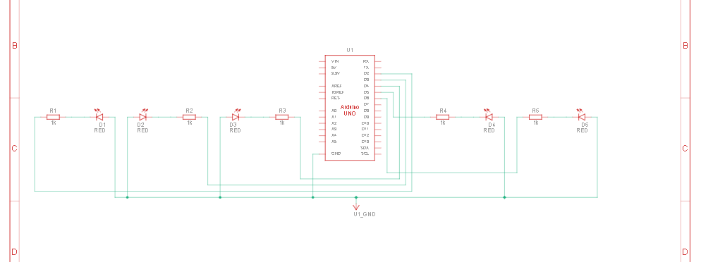

<h2>Modul Perulangan dan Percabangan</h2>

## 1.5.4 Percobaan 1A: Percabangan

1. Pada kondisi apa program masuk ke blok if?

   > Program masuk ke blok `if` ketika nilai variabel `timeDelay <= 100`.

2. Pada kondisi apa program masuk ke blok else?

   > Program masuk ke blok `else` ketika `timeDelay > 100`. 

3. Apa fungsi dari perintah delay(timeDelay)?

   > `delay(timeDelay)` berfungsi menunda eksekusi program selama `timeDelay` milidetik. `delay` secara langsung menentukan kecepatan kedipan LED. Semakin kecil nilai `timeDelay`, semakin cepat LED berkedip, dan sebaliknya.

4. Jika program yang dibuat memiliki alur mati → lambat → cepat → reset (mati),
ubah menjadi LED tidak langsung reset → tetapi berubah dari cepat → sedang →
mati dan berikan penjelasan disetiap baris kode nya dalam bentuk README.md!

   ```c++
   // Modifikasi Percobaan 1A: LED cepat -> sedang -> mati
const int ledPin = 6;        // LED terhubung ke pin digital 6
int timeDelay = 1000;        // waktu delay awal (lambat)
int arah = -1;               // -1 = percepat, 1 = perlambat

void setup() {
    pinMode(ledPin, OUTPUT); // set pin 6 sebagai output
}

void loop() {
    digitalWrite(ledPin, HIGH);  // nyalakan LED
    delay(timeDelay);            // tahan sesuai timeDelay
    digitalWrite(ledPin, LOW);   // matikan LED
    delay(timeDelay);            // tahan sesuai timeDelay

    // Jika kecepatan sudah mencapai batas cepat (delay <= 100)
    if (timeDelay <= 100) {
        arah = 1;                // ubah arah menjadi perlambat
    }
    // Jika kecepatan sudah mencapai batas lambat (delay >= 1000)
    else if (timeDelay >= 1000) {
        arah = -1;               // ubah arah menjadi percepat
    }

    // Ubah timeDelay: percepat jika arah=-1, perlambat jika arah=1
    timeDelay += arah * 100;

    // Jika delay mencapai 1000 dan sedang dalam mode perlambat (arah=1)
    if (timeDelay == 1000 && arah == 1) {
        digitalWrite(ledPin, LOW);  // pastikan LED mati
        delay(3000);                // mati total selama 3 detik
        timeDelay = 1000;           // reset ke delay awal
        arah = -1;                  // reset arah ke percepatan
    }
}
   ```

## 1.6.4 Percobaan 2A: Perulangan

1. Gambarkan rangkaian schematic 5 LED running yang digunakan pada percobaan!



2. Jelaskan bagaimana program membuat efek LED berjalan dari kiri ke kanan!

   > Program membuat efek LED berjalan dari kiri ke kanan dengan menggunakan pengulangan `for (int ledPin = 2; ledPin < 8; ledPin++)` dalam function loop. Pada baris tersebut telihat melakukan pengulangan for dimulai dari angka 2-8 dengan menggunakan increment, dimana itu merupakan pin yang digunakan sesuai urutan (rendah - tinggi).

3. Jelaskan bagaimana program membuat LED kembali dari kanan ke kiri!

   > Program membuat efek LED kembali dari kanan ke kiri menggunakan cara yang sama dengan no 2 tadi yaitu `for (int ledPin = 7; ledPin >= 2; ledPin--)`, bedanya inisiasi awal pin lED dari 7-2 dengan menggunakan decrement.

4. Buatkan program agar LED menyala tiga LED kanan dan tiga LED kiri secara bergantian

   ```c++
   int timer = 500; // variabel penampung jeda antar lampu
   unsigned int phase = 0; // variabel penampung fase, 0 (2-4, menyala), 1 (5-7 menyala), positif only

   void setup() { // fungsi yang akan di jalankan sekali saat arduino menyala
       for (int ledPin = 2; ledPin < 8; ledPin++) { // looping dari angka 2-7, untuk menginisiasi pin
           pinMode(ledPin, OUTPUT); // menginisiasi pin led sesuai looping menjadi output
       }
   }
   void loop() { // fungsi yang akan dijalankan terus menerus oleh arduino
       phase %= 2; // penahan, agar nilai phase tidak lebih dari 1, hanya 0 & 1
       for (int ledPin = 2; ledPin < 8; ledPin++) {
           if(ledPin <= 4) { // mengecek, apakah pin saat looping kurang dari atau sama dengan 4 (bagian kanan, 2,3,4)
           digitalWrite(ledPin, phase == 0 ? HIGH : LOW); // menyalakan atau mematikan LED sesuai dengan phase
           } else { // berarti pin kiri (5,6,7)
           digitalWrite(ledPin, phase == 0 ? LOW : HIGH); // menyalakan atau mematikan LED sesuai dengan phase, tetapi berkebalikan
           }
       }
       delay(timer); // memberikan jeda antar lampu
       phase++; // melanjutkan fase
   }
   ```

<h2></h2>

<br>
<div align="center">
  <a href="https://github.com/uckypradestha"></a>
  
  <a href="https://www.linkedin.com/uckypradestha/"></a>
  
  <a href="https://twitter.com/uckypradestha"></a>
  
  <a href="https://www.youtube.com/@ckypradestha"></a>
  
  <a href="https://www.tiktok.com/@pradestha"></a>
  
</div>
