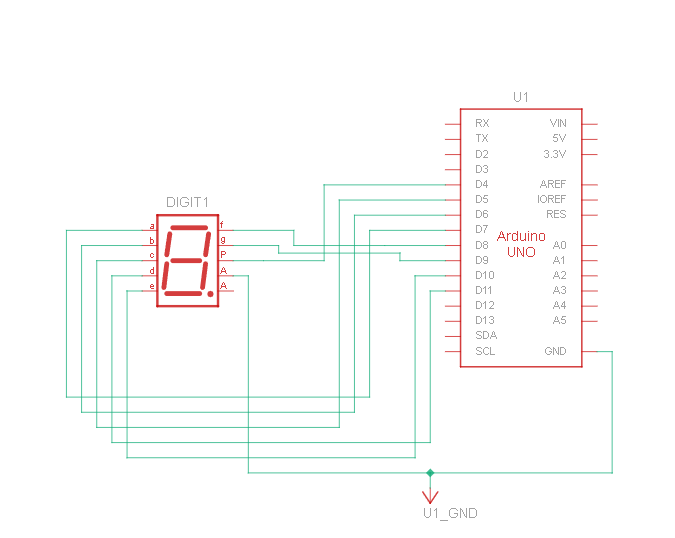
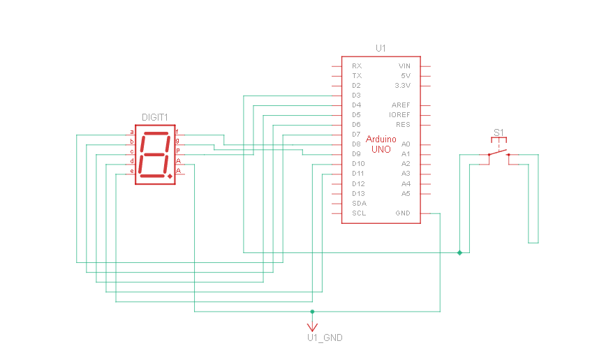

# Pertemuan 2

## 2.5.4 Pertanyaan Percobaan 2A: Seven Segment

1. Gambarkan rangkaian schematic yang digunakan pada percobaan!



2. Apa yang terjadi jika nilai num lebih dari 15?

   > Jika num > 15, program mengakses array digitPattern di luar batas (indeks 0-15). Ini menyebabkan tampilan acak atau program crash. Untuk mencegahnya, pada program counter ditambahkan if (counter > 15) counter = 0;.

3. Apa program ini menggunakan common cathode atau common anode? Jelaskan alasannya!

   > Iya, Common anode. Karena ada operator ! yang membalik nilai pola. Pada common anode, segmen menyala saat pin diberi LOW, jadi pola 1 (ingin nyala) harus dikirim sebagai 0. Tanpa pembalikan, program akan cocok untuk common cathode.

4. Modifikasi program agar tampilan berjalan dari F ke 0 dan berikan penjelasan di setiap baris kode nya dalam bentuk README.md!

   ```c++
   // Modifikasi Percobaan 2A: Seven Segment Counter dari F ke 0
   #include <Arduino.h>
   
   const int segmentPins[8] = {7, 6, 5, 11, 10, 8, 9, 4};
   
   byte digitPattern[16][8] = {
       {1,1,1,1,1,1,0,0}, // 0
       {0,1,1,0,0,0,0,0}, // 1
       {1,1,0,1,1,0,1,0}, // 2
       {1,1,1,1,0,0,1,0}, // 3
       {0,1,1,0,0,1,1,0}, // 4
       {1,0,1,1,0,1,1,0}, // 5
       {1,0,1,1,1,1,1,0}, // 6
       {1,1,1,0,0,0,0,0}, // 7
       {1,1,1,1,1,1,1,0}, // 8
       {1,1,1,1,0,1,1,0}, // 9
       {1,1,1,0,1,1,1,0}, // A
       {0,0,1,1,1,1,1,0}, // b
       {1,0,0,1,1,1,0,0}, // C
       {0,1,1,1,1,0,1,0}, // d
       {1,0,0,1,1,1,1,0}, // E
       {1,0,0,0,1,1,1,0}  // F
   };
   
   void displayDigit(int num) {
       for (int i = 0; i < 8; i++) {
           digitalWrite(segmentPins[i], !digitPattern[num][i]);
       }
   }
   
   void setup() {
       for (int i = 0; i < 8; i++) {
           pinMode(segmentPins[i], OUTPUT);
       }
   }
   
   void loop() {
       // Perulangan dari 15 (F) turun ke 0
       for (int i = 15; i >= 0; i--) {
           displayDigit(i);
           delay(1000);
       }
   }
   ```

## 2.6.4 Pertanyaan Percobaan 2B: Kontrol Counter Dengan Push Button

1. Gambarkan rangkaian schematic yang digunakan pada percobaan!



2. Mengapa pada push button digunakan mode INPUT_PULLUP pada Arduino Uno? Apa keuntungannya dibandingkan rangkaian biasa?

   > INPUT_PULLUP mengaktifkan resistor pull-up internal (20kΩ), sehingga pin membaca HIGH saat tombol tidak ditekan, LOW saat ditekan. Keuntungan: tidak perlu resistor eksternal, rangkaian lebih sederhana, hemat biaya.

3. Jika salah satu LED segmen tidak menyala, apa saja kemungkinan penyebabnya dari sisi hardware maupun software?

   > Hardware: kabel longgar, resistor putus, segmen rusak, pin Arduino rusak.
   > Software: nilai pola salah, pin salah di array segmentPins, lupa operator ! untuk common anode, pinMode tidak diatur.


4. Modifikasi rangkaian dan program dengan dua push button yang berfungsi sebagai penambahan (increment) dan pengurangan (decrement) pada sistem counter dan berikan penjelasan disetiap baris kodenya dalam bentuk README.md!

   ```c++
   #include <Arduino.h>

   // Pin untuk segmen a, b, c, d, e, f, g, dp
   const int segmentPins[8] = {7, 6, 5, 11, 10, 8, 9, 4};
   
   // Pin untuk dua tombol
   const int buttonUp = 3;   // Tombol Tambah
   const int buttonDown = 2; // Tombol Kurang (Hubungkan ke Pin 2)
   
   int counter = 0;
   
   // Variabel untuk menyimpan status terakhir masing-masing tombol
   bool lastUpState = HIGH;
   bool lastDownState = HIGH;
   
   // Pola angka 0-F (Hexadecimal)
   byte digitPattern[16][8] = {
     {1,1,1,1,1,1,0,0}, //0
     {0,1,1,0,0,0,0,0}, //1
     {1,1,0,1,1,0,1,0}, //2
     {1,1,1,1,0,0,1,0}, //3
     {0,1,1,0,0,1,1,0}, //4
     {1,0,1,1,0,1,1,0}, //5 
     {1,0,1,1,1,1,1,0}, //6
     {1,1,1,0,0,0,0,0}, //7
     {1,1,1,1,1,1,1,0}, //8
     {1,1,1,1,0,1,1,0}, //9
     {1,1,1,0,1,1,1,0}, //A
     {0,0,1,1,1,1,1,0}, //b
     {1,0,0,1,1,1,0,0}, //C
     {0,1,1,1,1,0,1,0}, //d
     {1,0,0,1,1,1,1,0}, //E
     {1,0,0,0,1,1,1,0}  //F
   };
   
   void displayDigit(int num) {
     for(int i=0; i<8; i++) {
       // Menggunakan '!' karena asumsi hardware Common Anode
       digitalWrite(segmentPins[i], !digitPattern[num][i]);
     }
   }
   
   void setup() {
     // Inisialisasi semua pin segmen sebagai OUTPUT
     for(int i=0; i<8; i++) {
       pinMode(segmentPins[i], OUTPUT);
     }
   
     // Inisialisasi tombol sebagai INPUT_PULLUP
     pinMode(buttonUp, INPUT_PULLUP);
     pinMode(buttonDown, INPUT_PULLUP);
   
     // Tampilkan angka 0 saat awal dinyalakan
     displayDigit(counter);
   }
   
   void loop() {
     // Baca status tombol saat ini
     bool currentUpState = digitalRead(buttonUp);
     bool currentDownState = digitalRead(buttonDown);
   
     // --- LOGIKA TOMBOL TAMBAH ---
     if (lastUpState == HIGH && currentUpState == LOW) {
       counter++;
       if(counter > 15) counter = 0; // Jika lebih dari 15 (F), balik ke 0
       displayDigit(counter);
       delay(200); // Debounce sederhana
     }
   
     // --- LOGIKA TOMBOL KURANG ---
     if (lastDownState == HIGH && currentDownState == LOW) {
       counter--;
       if(counter < 0) counter = 15; // Jika kurang dari 0, balik ke 15 (F)
       displayDigit(counter);
       delay(200); // Debounce sederhana
     }
   
     // Simpan status terakhir untuk pengecekan di loop berikutnya
     lastUpState = currentUpState;
     lastDownState = currentDownState;
   }
   }
   ```
